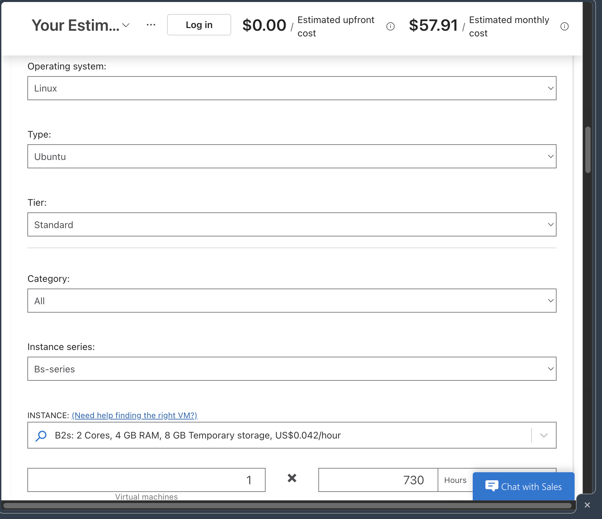
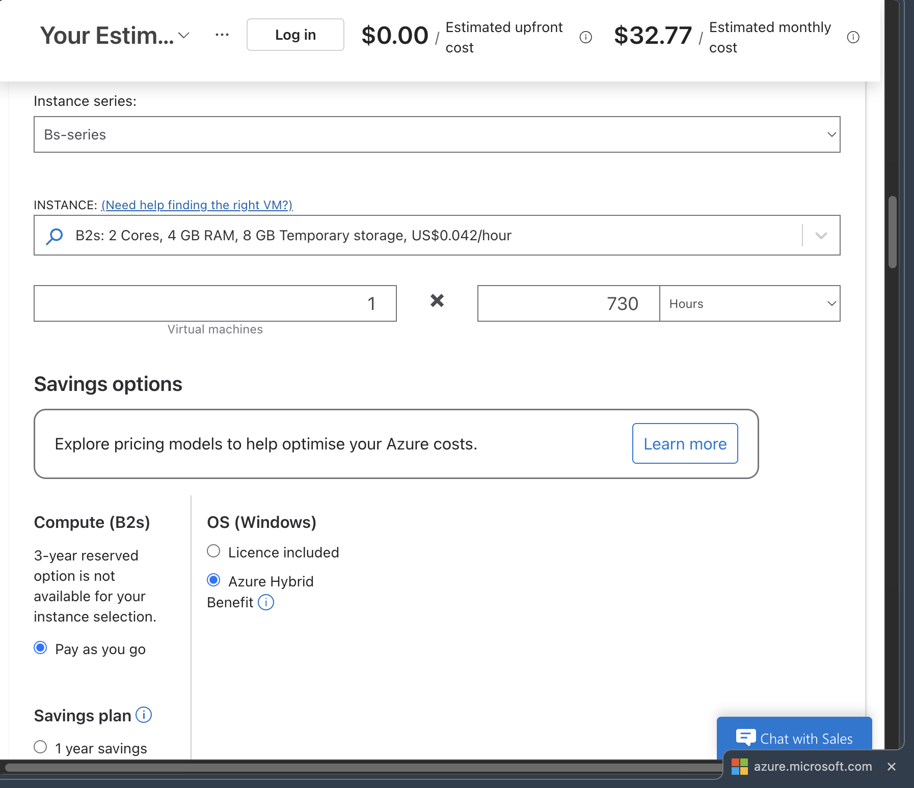

# aws-vs-azure-cost-comparison
Cloud economics project comparing AWS and Azure hosting costs for equivalent VM configurations.

## 1. AWS Linux Estimate
- **Instance**: t3.small, 2 vCPU, 2 GB RAM
- **Storage**: 32 GB gp3 EBS
- **Data Transfer**: 100 GB Internet Egress
- **Total**: **$29.53/month**

File: `aws-estimate.csv`  
Screenshot: 

## 2. Azure Linux VM Estimate
- **Instance**: B2s, 2 vCPU, 4 GB RAM
- **Storage**: 32 GB Standard SSD
- **Data Transfer**: 100 GB Internet Egress*
- **Total**: **$57.91/month***

File: `azure-linux-estimate.xlsx`  
Screenshot: 

## 3. Azure Windows + Hybrid Benefit
| Component | Detail | Cost |
| --- | --- | --- |
| Instance | B2s Windows w/ Azure Hybrid Benefit | $30.37 |
| Storage | 32 GB Standard SSD E4 | $2.40 |
| Data Transfer | 100 GB Internet Egress* | $0.00* |
| **Total** | | **$32.77/month*** |

File: `azure-windows-hybrid-estimate.xlsx`  
Screenshot: 

---

### Notes
*Azure Pricing Calculator bug: 100GB Internet Egress was configured for both Azure VMs but displays as $0.00.

**Expected monthly cost with bandwidth included:**
- Azure Linux B2s: ~$71.38/month
- Azure Windows B2s w/ Hybrid Benefit: ~$46.24/month

**VM Specifications:** All configurations use 2 vCPU, 32GB Standard SSD, 100GB Internet Egress  
*AWS t3.small has 2GB RAM. Azure B2s has 4GB RAM.
