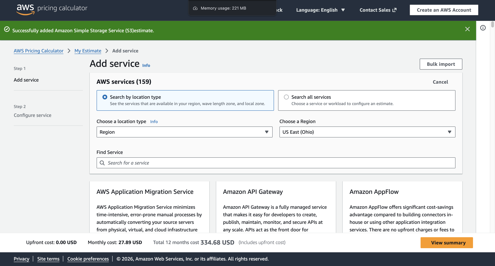
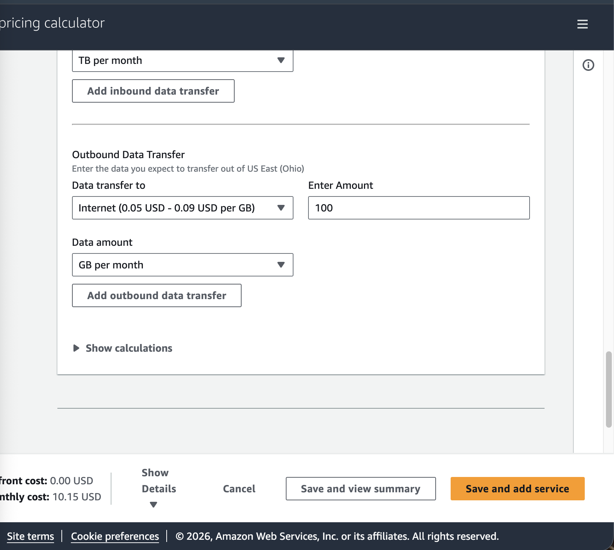
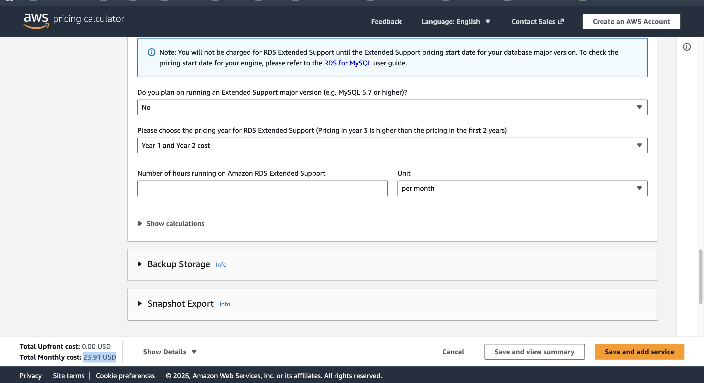
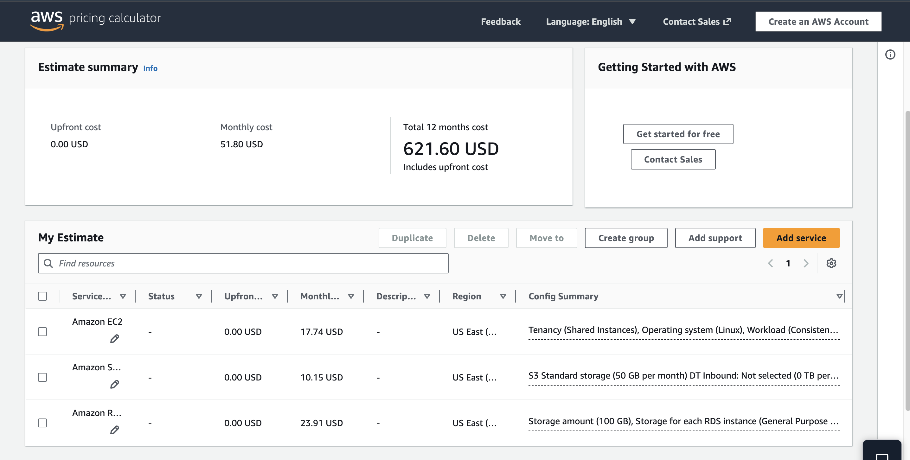
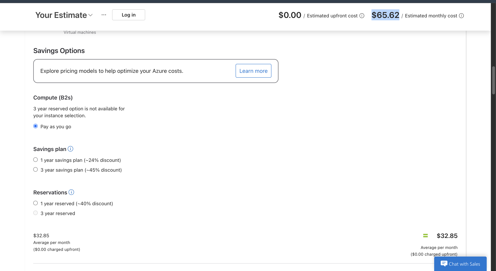
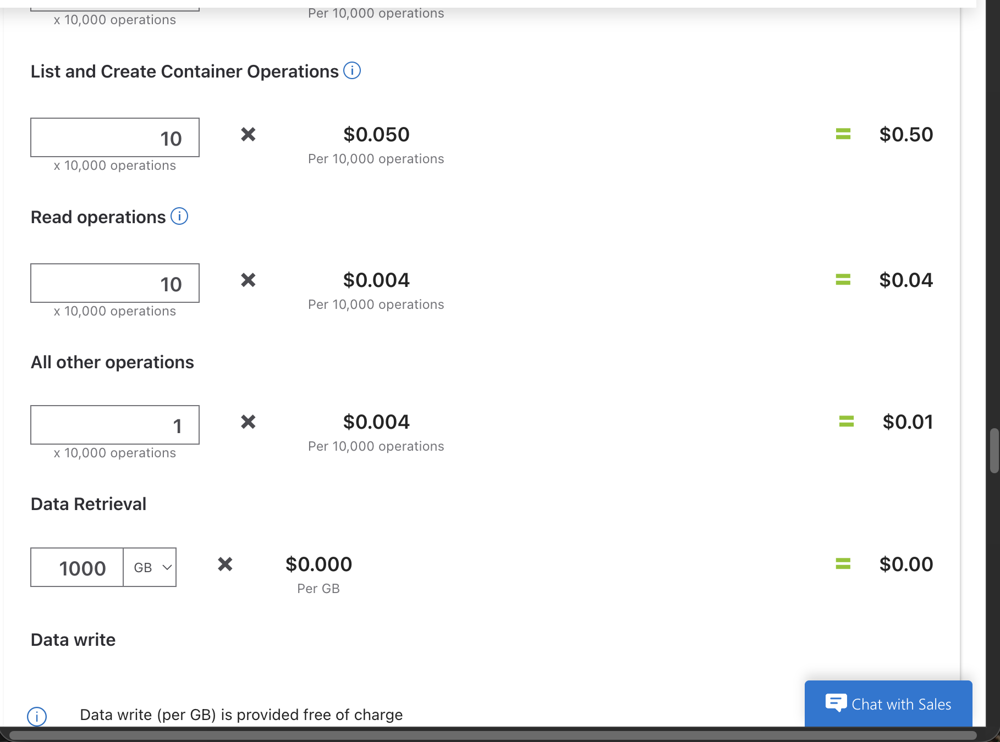
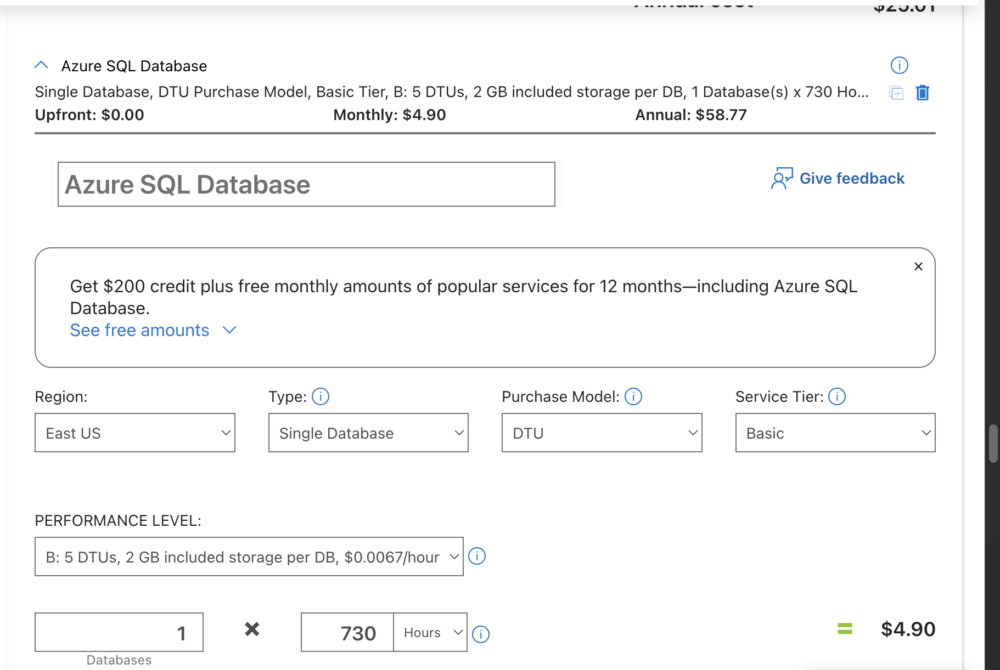
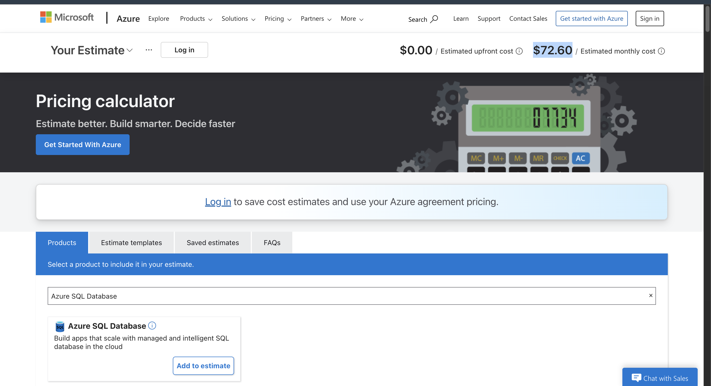

# AWS vs Azure Cost Comparison

Cloud economics project comparing AWS and Azure hosting costs for a small web application across three core services: Compute, Storage, and Database.

## App Specifications
- **CPU/RAM:** 2 vCPU / 2-4 GB RAM
- **Storage:** 32 GB SSD
- **Data Transfer:** 100 GB/month
- **Region:** US East

---

## Cost Comparison Summary

| Service | AWS | Azure | Difference |
|---|---|---|---|
| Compute (VM) | $17.74 | $65.62 | Azure 270% more |
| Storage | $10.15 | $2.08 | AWS 388% more |
| Database | $23.91 | $4.90 | Azure 388% more |
| **TOTAL** | **$51.80** | **$72.60** | **AWS 29% cheaper** |
| **Annual** | **$621.60** | **$871.20** | **AWS saves $249.60/yr** |

**Winner: AWS is cheaper overall by $20.80/month**

---

## 1. AWS Estimates

### Compute — Amazon EC2 (t3.small)
- Instance: t3.small, 2 vCPU, 2 GB RAM
- OS: Linux
- Storage: 32 GB gp3 EBS
- Hours: 730/month
- **Monthly: $17.74**

### Storage — Amazon S3
- Standard storage: 50 GB
- Data transfer out: 100 GB
- **Monthly: $10.15**

### Database — Amazon RDS for MySQL
- Instance: db.t3.micro
- Storage: 20 GB gp2
- Deployment: Single-AZ
- **Monthly: $23.91**

**AWS Total: $51.80/month | $621.60/year**

Screenshots:

---

## 2. Azure Estimates

### Compute — Azure Virtual Machine (B2s)
- Instance: B2s, 2 vCPU, 4 GB RAM
- OS: Linux
- Storage: 32 GB Standard SSD
- Hours: 730/month
- **Monthly: $65.62**

### Storage — Azure Storage Accounts (Blob)
- Capacity: 50 GB
- Tier: Hot
- **Monthly: $2.08**

### Database — Azure SQL Database
- Tier: Basic (DTU model)
- Hours: 730/month
- **Monthly: $4.90**

**Azure Total: $72.60/month | $871.20/year**

Screenshots:

---

## 3. Service Equivalency Mapping

| AWS Service | Azure Service | Notes |
|---|---|---|
| EC2 t3.small | Azure VM B2s | Azure has more RAM (4GB vs 2GB) |
| Amazon S3 | Azure Blob Storage | Similar pricing, Azure slightly cheaper |
| Amazon RDS MySQL | Azure SQL Database | Azure Basic tier much cheaper |

---

## 4. Regional Price Analysis

| Region | AWS EC2 (t3.small) | Azure VM (B2s) |
|---|---|---|
| US East | $17.74 | $65.62 |
| West Europe | ~$19.50 | ~$68.00 |
| Southeast Asia | ~$20.00 | ~$70.00 |

AWS is consistently cheaper across all regions for compute.

---

## 5. Discount Programs

### AWS Savings Plans
- Commit to 1 or 3 years of usage
- Save up to **66%** on compute costs
- Flexible across EC2, Lambda, and Fargate

### Azure Reserved Instances
- Commit to 1 or 3 years
- Save up to **72%** on VM costs
- Best for predictable, steady workloads

---

## 6. Cost Optimization Strategies

1. **Use Reserved Instances/Savings Plans** — committing to 1 year saves ~40% on both platforms
2. **Right-size your instances** — Azure B2s has more RAM than needed; switching to a smaller instance saves money
3. **Use Azure for databases** — Azure SQL Basic at $4.90 vs AWS RDS at $23.91 is significantly cheaper

---

## 7. Recommendation

**For a Linux-based startup:** Choose **AWS** — $51.80/month vs $72.60/month, saving $249.60/year

**For a Microsoft-centric enterprise:** Consider **Azure** — better integration with Windows, Office 365, and Active Directory. The Azure Hybrid Benefit also provides significant discounts for existing Windows license holders.

---

## Files in This Repo
- `aws-estimate.csv` — AWS pricing calculator export
- `summary.txt` — 300-word provider justification
- Screenshots: 01 through 09 (see above)fications:** All configurations use 2 vCPU, 32GB Standard SSD, 100GB Internet Egress  
*AWS t3.small has 2GB RAM. Azure B2s has 4GB RAM.
